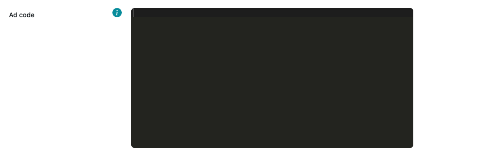
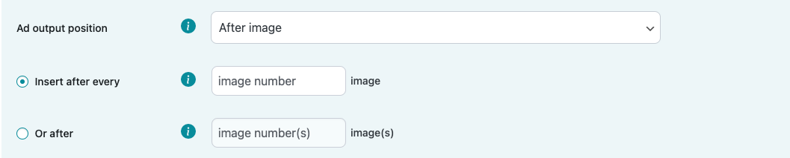
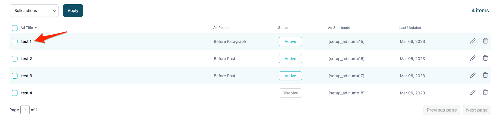
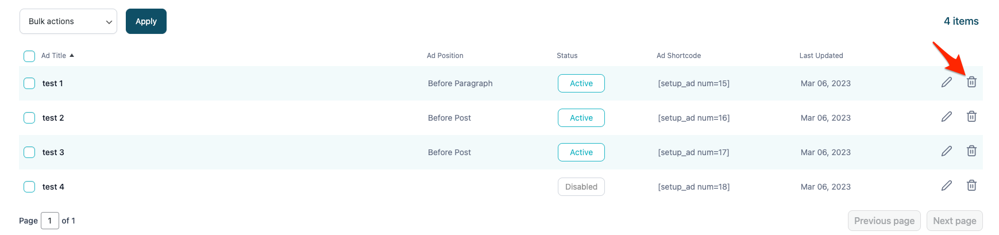
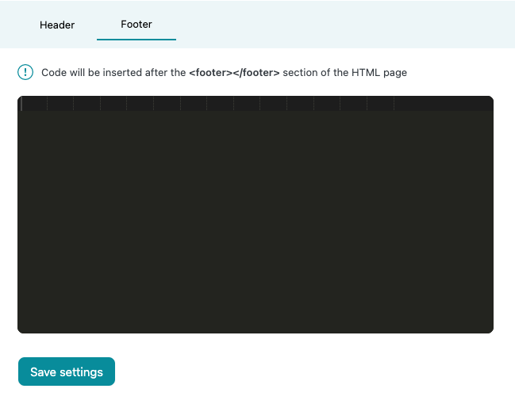

# Ad insertion

With our plugin, it is possible to insert ad scripts or upload your own images/image ads and insert them into your WordPress website's content.

## Ad title:

**Ad title** - Ad placement title field for you to differentiate between multiple ad placements. This field will be visible only in the **My ads** section.

## Ad type:

In this dropdown selection, you must choose what type of content you want to display in this ad placement. There are two options:

1. Ad code - HTML and/or JavaScript code snippet usually provided by the third-party monetization platforms.
2. Image - your uploaded image from your files (accepted image formats are: JPG/JPEG, PNG, WebP, GIF).

## Ad code (1):

Insert your third-party monetization partner's ad code snippet inside this code block.

## Upload image (2):

Upload an image from your files. We accept the following formats:

* JPEG/JPG
* PNG
* WebP
* GIF

## Page insertion:

In this selection, you must  choose one or multiple WordPress page types in which your ad placement will be inserted, e.g., Post pages and Homepage.

## Device selection:

In this selection, you must choose what type of devices your ad placement will be visible on. You can select a single device, all devices, or a combination of devices, e.g., Desktop and Tablet (excluding mobile).

## Ad placement alignment:

In this selection, you must choose if you want to create a wrapper around your ad placement and align your ad. There are already 3 built-in alignment options(left, centered, right). If you choose the custom alignment option, you will have to manually write your own CSS code to align ad placement. All of these styles are inserted in the wrapper's inline CSS.

## Insertion positions:

**Disabled** - Ad placement with this type of position will be disabled/inactive. It won't be displayed anywhere but you will be able to find it in the **My ads** section.

**Before post** - Insertion uses inbuilt WordPress **loop_start **hook and inserts ad placements before a WordPress post.

**Between posts** - Insertion uses inbuilt WordPress **the_post** hook and inserts ad placements between specified posts (usually used in Category pages). You have two options for placement insertion:

* Between every nth post (This ad placement will be inserted incrementally. If you choose to insert ad placement before every 2nd post, the ad will be inserted before 2, 4, 6, 8,etc. post).
* Before specific post(s). Divide your post numbers with commas - 1, 3, 7, 9, 15, etc. (the ad placement will be inserted before each of these posts).

**After post** - Insertion uses inbuilt WordPress **loop_end** hook and inserts ad placements after WordPress post.

**Before content** - Insertion uses inbuilt WordPress **the_content** hook and inserts ad placements before WordPress post/page content.

**After content** - Insertion uses inbuilt WordPress **the_content** hook and inserts ad placements after WordPress post/page content.

**Before paragraph** - Insertion uses inbuilt WordPress **the_content** hook and explodes all HTML &lt;p> (paragraph) tags, then inserts ad placement before the corresponding paragraph. You have two options for paragraph insertion:

* Before every nth paragraph (This ad placement will be inserted incrementally. If you choose to insert ad placement before every 2nd paragraph, the ad will be inserted before 2, 4, 6, 8,etc. paragraph).
* Before specific paragraph(s). Divide your paragraph numbers with commas - 1, 3, 7, 9, 15, etc. (the ad placement will be inserted before each of these paragraphs).

**After paragraph** - Insertion uses inbuilt WordPress **the_content** hook, explodes all HTML &lt;p> (paragraph) tags, then inserts ad placement after the corresponding paragraph. You have two options for paragraph insertion:

* After every nth paragraph (This ad placement will be inserted incrementally. If you choose to insert ad placement after every 2nd paragraph, the ad will be inserted after 2, 4, 6, 8, etc. paragraph).
* After specific paragraph(s). Divide your paragraph numbers with commas - 1, 3, 7, 9, 15, etc. (the ad placement will be inserted after each of these paragraphs).

**Before image** - Insertion uses inbuilt WordPress **the_content** hook, locates all image starting positions with the help of regex, and then inserts ad placement before the corresponding image. You have two options for image insertion:

* Before every nth image (This ad placement will be inserted incrementally. If you choose to insert ad placement before every 2nd image, the ad will be inserted before 2, 4, 6, 8, etc. image).
* Before specific image(s). Divide your image numbers with commas - 1, 3, 7, 9, 15, etc. (ad placement will be inserted before each of these images).

**After image** - Insertion uses inbuilt WordPress **the_content** hook, locates all image ending positions with the help of regex, and then inserts ad placement after the corresponding image. You have two options for image insertion:

* After every nth image (This ad placement will be inserted incrementally. If you choose to insert ad placement after every 2nd image, the ad will be inserted after 2, 4, 6, 8, etc. image).
* After specific image(s). Divide your image numbers with commas - 1, 3, 7, 9, 15, etc. (ad placement will be inserted before each of these images).

**Before comments** - Insertion uses inbuilt WordPress **comments_array** hook to count comments and **wp_list_comments_args** hook to insert a custom comment callback, which inserts ad placement before all comments.

**Between comments** - Insertion uses inbuilt WordPress **comments_array** hook to count comments and **wp_list_comments_args** hook to insert a custom comment callback, which inserts ad placement between selected comments. You have two options for placement insertion:

* Between every comment (This ad placement will be inserted incrementally. If you choose to insert ad placement between every 2nd comment, the ad will be inserted after 2, 4, 6, 8, etc. comment).
* Before specific comment(s). Divide your comment numbers with commas - 1, 3, 7, 9, 15, etc. (ad placement will be inserted after each of these comments).

**After comments** - Insertion uses inbuilt WordPress **comments_array** hook to count comments and **wp_list_comments_args **hook to insert a custom comment callback, which inserts ad placement after all comments.

**Before excerpt** - Insertion uses inbuilt WordPress **the_excerpt** hook to insert ad placement before specified excerpt. You have two options for excerpt insertion:

* Before every nth excerpt (This ad placement will be inserted incrementally. If you choose to insert ad placement before every 2nd excerpt, the ad will be inserted before 2, 4, 6, 8, etc. excerpt).
* Before specific excerpt(s). Divide your image numbers with commas - 1, 3, 7, 9, 15, etc. (ad placement will be inserted before each of these images).

**After excerpt** - Insertion uses inbuilt WordPress **the_excerpt** hook to insert ad placement after specified excerpt. You have two options for excerpt insertion:

* After every nth excerpt (This ad placement will be inserted incrementally. If you choose to insert ad placement after every 2nd excerpt, the ad will be inserted before 2, 4, 6, 8, etc. excerpt).
* After specific excerpt(s). Divide your image numbers with commas - 1, 3, 7, 9, 15, etc. (ad placement will be inserted after each of these images).

**Footer** - Insertion uses inbuilt WordPress **wp_footer** hook and inserts ad placements right before closing &lt;/body> tag.

**Before sidebar** - Insertion uses inbuilt WordPress **dynamic_sidebar_before** hook and inserts ad placements before dynamic WordPress sidebar.

**After sidebar** - Insertion uses inbuilt WordPress **dynamic_sidebar_after** hook and inserts ad placements after dynamic WordPress sidebar.

## Lazy loading:

It is possible to enable lazy loading for ad placements. We use the InView lazy loading library to do it. When lazy loading is enabled, we divide pure HTML from Javascript using PHP HTML parser. When your ad placement is in view, we create a respective HTML element and then execute your JavaScript.

When using third-party ad scripts, we  recommend you to ask your partner for ad placements with predefined lazy loading. Depending on ad script structure and execution logic, some ad scripts might not work properly.

# Managing ad placements

Ad placement can be managed in the **My ads** section of the plugin.

**Editing ad placement** - ad placement can be edited to two ways:

1. Clicking the pencil icon in the **My ads** section.
   
2. Clicking the title of the ad placement.
   

**Sorting ad placements** - all ad placements can be sorted by simply clicking on the table column title. The ad placement will be sorted either in ascending or descending order.

**Delete ad placement** - ad placement can be deleted in 3 ways:

1. Clicking on the trash icon in the **My ads** section.
   
2. Clicking on the **Delete ad unit** button when editing existing ad placement.
   
3. Select all ad units you want to delete. Click on **Bulk Actions** dropdown, choose **Delete** and click **Apply**.
   

# Related posts

Related posts, or related articles block, automatically suggests top recommended articles to the user. Most of the time, it’s placed at the end of the article. It’s used to increase user engagement with the website and generate traffic to other articles within your site (more pageviews).

Related posts section uses inbuilt WordPress **the_content** hook to insert related posts after your post's main content.

## Related posts block:

This enables a related posts section on your website,you need to also fill other fields in this section, e.g., categories, posts per categories, etc.

## Category selection:

In this selection, you must choose which categories you want to show in the related posts section. You can select an unlimited number of categories.

All categories shown in the dropdown menu are in your WordPress categories **(Posts > Categories)**.

## Post count per category selection:

In this selection, you must choose how many posts you want to display per each category, e.g., 2, 4, 6, etc.

## Insert ads between categories:

This switch enables you to insert ads between every category section that you have selected previously. After this field is enabled, the **Ad code** input field will be shown and you will have to insert your third-party ad code there.

This is how the related posts section would look like if you selected 2 categories (cars, popular), 4 posts per category, and a 728x90 third-party ad script. 

# Ads.txt insertion

Ads.txt is a public file that declares who is authorized to sell the publishers' inventory. The purpose of the ads.txt file is to ensure that publishers' ad inventory is only sold through authorized channels, and that they are paid the correct amount for their inventory. Ads.txt also helps to prevent fraud, such as domain spoofing.

Our plugin doesn't create a physical ads.txt file in your filesystem, it creates a virtual ads.txt file that is displayed for this URL: yourDomain.com/ads.txt.

## Before you insert ads.txt lines:

Our plugin won't insert ads.txt into your website if you already have ads.txt file in your file system/server. If you want to use ads.txt insertion, make sure you have deleted ads.txt from your file system/server.

If you have a subdirectory WordPress installation (e.g., yourDomain.com/subdirectory/WPInstallation), then you won't be allowed to save ads.txt lines. Make sure you have a root domain WordPress installation.

## Ads.txt line validation:

Our plugin validates your ads.txt lines., If there are any errors, the plugin will display on which ads.txt lines the errors were found. You still can update ads.txt with following errors by enabling **Update ads.txt anyway?** field.

---
title: Header and footer content insertion
layout: home
---

# Header and footer content insertion

**Header** - Insertion uses inbuilt WordPress **wp_head** hook and inserts your provided code inside the **&lt;head>** part of your website.

**Footer** - Insertion uses inbuilt WordPress **wp_footer** hook and inserts your provided code right after the **&lt;footer>** part of your website.

