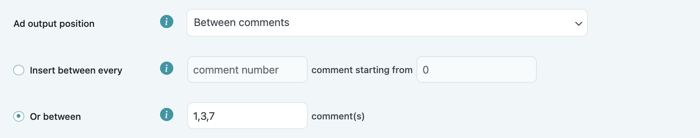
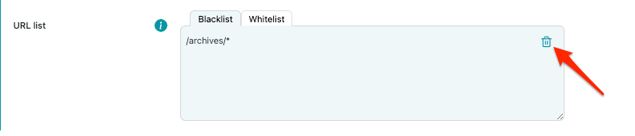

# Ad insertion

With our plugin, it is possible to insert ad scripts or upload your own images/image ads and insert them into your WordPress website's content.

## Ad title:

**Ad title** - Ad placement title field for you to differentiate between multiple ad placements. This field will be visible only in the **My ads** section.

## Ad type:

In this dropdown selection, you must choose what type of content you want to display in this ad placement. There are two options:

1. Ad code - HTML and/or JavaScript code snippet usually provided by the third-party monetization platforms.
2. Double banner - Two HTML and/or Javascript code snippets usually provided by the third-party monetization platforms to be inserted next to or above each other.
3. Image - your uploaded image from your files (accepted image formats are: JPG/JPEG, PNG, WebP, GIF).
4. Shortcode - an active shortcode on your website.

## Ad code (1):

Insert your third-party monetization partner's ad code snippet inside this code block.

## Double banner (2):

Insert your third-party monetization partner's ad code snippets inside the first and second code blocks.

## Image (3):

Upload an image from your files. We accept the following formats:

* JPEG/JPG
* PNG
* WebP
* GIF

**Image dimensions** - sets defined **width** and **height** in pixels for the  element of your inserted picture. Empty fields will not set any fixed dimensions.

**Image alt text** - will add entered value to the alt attribute of the  element of your inserted image with the text that has been saved in the field. An empty field will not add any value to the alt attribute of the image.

## Shortcode (4):

Insert any active shortcode (e.g., \[setupad num=”7”]). Shortcode insertion uses inbuilt WordPress do_action() function to parse the shortcode.

## Page insertion:

In this selection, you must  choose one or multiple WordPress page types in which your ad placement will be inserted, e.g., Post pages and Homepage. By default Post pages will be selected.

## Device selection:

In this selection, you must choose what type of devices your ad placement will be visible on. You can select a single device, all devices, or a combination of devices, e.g., Desktop and Tablet (excluding mobile).

## Ad placement alignment:

In this selection, you must choose if you want to create a wrapper around your ad placement and align your ad. There are already 3 built-in alignment options(left, centered, right). If you choose the custom alignment option, you will have to manually write your own CSS code to align ad placement. All of these styles are inserted in the wrapper's inline CSS.

## Insertion positions:

**Disabled** - Ad placement with this type of position will be disabled/inactive. It will not be displayed anywhere but you will be able to find it in the **My ads** section.

**Before post** - Insertion uses inbuilt WordPress **loop_start **hook and inserts ad placements before a WordPress post.

**Between posts** - Insertion uses inbuilt WordPress **the_post** hook and inserts ad placements between specified posts (usually used in Category pages). You have two options for placement insertion:

* Between every nth post starting from the nth post (This ad placement will be inserted incrementally. It will be inserted only starting from the specified post and every nth post after that as specified in the previous field. Default starting position is empty and will start insertion from the previously specified nth post. If you choose to insert ad placement before every 2nd post starting from 3rd post, the ad will be inserted before 3, 5, 7, 9,etc. post).
* Between specific post(s). Divide your post numbers with commas - 1, 3, 7, 9, 15, etc. (the ad placement will be inserted before each of these posts).

**After post** - Insertion uses inbuilt WordPress **loop_end** hook and inserts ad placements after WordPress post.

**Before content** - Insertion uses inbuilt WordPress **the_content** hook and inserts ad placements before WordPress post/page content.

**After content** - Insertion uses inbuilt WordPress **the_content** hook and inserts ad placements after WordPress post/page content.

**Before paragraph** - Insertion uses inbuilt WordPress **the_content** hook and explodes all HTML &lt;p> (paragraph) tags, then inserts ad placement before the corresponding paragraph. You have two options for paragraph insertion:

* Before every nth paragraph starting from nth paragraph (This ad placement will be inserted incrementally. It will be inserted only starting from the specified paragraph and every nth paragraph after that as specified in the previous field. Default starting position is empty and will start insertion from the previously specified nth paragraph. If you choose to insert ad placement before every 2nd paragraph starting from 3rd paragraph, the ad will be inserted before 3, 5, 7, 9,etc. paragraphs).
* Before specific paragraph(s). Divide your paragraph numbers with commas - 1, 3, 7, 9, 15, etc. (the ad placement will be inserted before each of these paragraphs).

**After paragraph** - Insertion uses inbuilt WordPress **the_content** hook, explodes all HTML &lt;p> (paragraph) tags, then inserts ad placement after the corresponding paragraph. You have two options for paragraph insertion:

* After every nth paragraph starting from nth paragraph (This ad placement will be inserted incrementally. It will be inserted only starting from the specified paragraph and every nth paragraph after that as specified in the previous field. Default starting position is empty and will start insertion from the previously specified nth paragraph. If you choose to insert ad placement after every 2nd paragraph starting from 3rd paragraph, the ad will be inserted after 3, 5, 7, 9,etc. paragraphs).
* After specific paragraph(s). Divide your paragraph numbers with commas - 1, 3, 7, 9, 15, etc. (the ad placement will be inserted after each of these paragraphs).

**Before image** - Insertion uses inbuilt WordPress **the_content** hook, locates all image starting positions with the help of regex, and then inserts ad placement before the corresponding image. You have two options for image insertion:

* Before every nth image (This ad placement will be inserted incrementally. It will be inserted only starting from the specified image and every nth image after that as specified in the previous field. Default starting position is empty and will start insertion from the previously specified nth image. If you choose to insert ad placement before every 2nd image starting from the 3rd image, the ad will be inserted before 3, 5, 7, 9,etc. images).
* Before specific image(s). Divide your image numbers with commas - 1, 3, 7, 9, 15, etc. (ad placement will be inserted before each of these images).

**After image** - Insertion uses inbuilt WordPress **the_content** hook, locates all image ending positions with the help of regex, and then inserts ad placement after the corresponding image. You have two options for image insertion:

* After every nth image (This ad placement will be inserted incrementally. It will be inserted only starting from the specified image and every nth image after that as specified in the previous field. Default starting position is empty and will start insertion from the previously specified nth image. If you choose to insert ad placement after every 2nd image starting from the 3rd image, the ad will be inserted after 3, 5, 7, 9,etc. images).
* After specific image(s). Divide your image numbers with commas - 1, 3, 7, 9, 15, etc. (ad placement will be inserted before each of these images).

**Before comments** - Insertion uses inbuilt WordPress **comments_array** hook to count comments and **wp_list_comments_args** hook to insert a custom comment callback, which inserts ad placement before all comments.

**Between comments** - Insertion uses inbuilt WordPress **comments_array** hook to count comments and **wp_list_comments_args** hook to insert a custom comment callback, which inserts ad placement between selected comments. You have two options for placement insertion:

* Between every comment (This ad placement will be inserted incrementally. It will be inserted only starting from the specified comment and every nth comment after that as specified in the previous field. Default starting position is empty and will start insertion from the previously specified nth comment. If you choose to insert ad placement between every 2nd comment starting from the 3rd comment, the ad will be inserted after 3, 5, 7, 9,etc. comments).
* Between specific comment(s). Divide your comment numbers with commas - 1, 3, 7, 9, 15, etc. (ad placement will be inserted after each of these comments).

**After comments** - Insertion uses inbuilt WordPress **comments_array** hook to count comments and **wp_list_comments_args **hook to insert a custom comment callback, which inserts ad placement after all comments.

**Before excerpt** - Insertion uses inbuilt WordPress **the_excerpt** hook to insert ad placement before specified excerpt. You have two options for excerpt insertion:

* Before every nth excerpt (This ad placement will be inserted incrementally. It will be inserted only starting from the specified excerpt and every nth excerpt after that as specified in the previous field. Default starting position is empty and will start insertion from the previously specified nth excerpt. If you choose to insert ad placement before every 2nd excerpt starting from the 3rd excerpt, the ad will be inserted before 3, 5, 7, 9,etc. excerpts).
* Before specific excerpt(s). Divide your image numbers with commas - 1, 3, 7, 9, 15, etc. (ad placement will be inserted before each of these images).

**After excerpt** - Insertion uses inbuilt WordPress **the_excerpt** hook to insert ad placement after specified excerpt. You have two options for excerpt insertion:

* After every nth excerpt (This ad placement will be inserted incrementally.  It will be inserted only starting from the specified excerpt and every nth excerpt after that as specified in the previous field. Default starting position is empty and will start insertion from the previously specified nth excerpt. If you choose to insert ad placement after every 2nd excerpt starting from the 3rd excerpt, the ad will be inserted after 3, 5, 7, 9,etc. excerpts).
* After specific excerpt(s). Divide your image numbers with commas - 1, 3, 7, 9, 15, etc. (ad placement will be inserted after each of these images).

**Footer** - Insertion uses inbuilt WordPress **wp_footer** hook and inserts ad placements right before closing &lt;/body> tag.

**Before sidebar** - Insertion uses inbuilt WordPress **dynamic_sidebar_before** hook and inserts ad placements before dynamic WordPress sidebar.

**After sidebar** - Insertion uses inbuilt WordPress **dynamic_sidebar_after** hook and inserts ad placements after dynamic WordPress sidebar.

## Advanced options:

There are multiple advanced options that you can apply to the specified ad placement before insertion. To see these options, click “Show advanced options” and a dropdown menu of available options will appear.

## Lazy loading (1):

It is possible to enable lazy loading for ad placements. We use the InView lazy loading library to do it. When lazy loading is enabled, we divide pure HTML from Javascript using PHP HTML parser. When your ad placement is in view, we create a respective HTML element and then execute your JavaScript.

When using third-party ad scripts, we  recommend you to ask your partner for ad placements with predefined lazy loading. Depending on ad script structure and execution logic, some ad scripts might not work properly.

## URL blacklist and whitelist (2):

There is an option to blacklist (exclude) and whitelist (include) URLs where you want or do not want the ad placement to be inserted.

Whitelist is a higher priority than a blacklist. If you whitelist an ad placement on a specific URL it will be shown only on that particular URL and blacklist will be ignored.

It is also possible to use a wildcard where the ad placement will be excluded from any url that follows the format of the wildcard URL, e.g. /archives/* (It will exclude ad placement insertion for all archive URLs /archives/posts, /archives/posts/this-is-my-post, etc.).

To blacklist or whitelist URLs, you must add them to the respective URL list. 

To blacklist a URL, enter the URL in the “URL Blacklist” field and then press “Add”.

To whitelist a URL, enter the URL in the “URL Whitelist” field and then press “Add”.

Only a single URL can be added at a time, if there is a wrong input, an error message will appear.

To remove a URL from your blacklist/whitelist click the delete icon next to the respective URL.

URL list is only saved when you save the ad unit, so make sure to save the ad unit after you are finished editing your whitelisted and blacklisted URLs.

