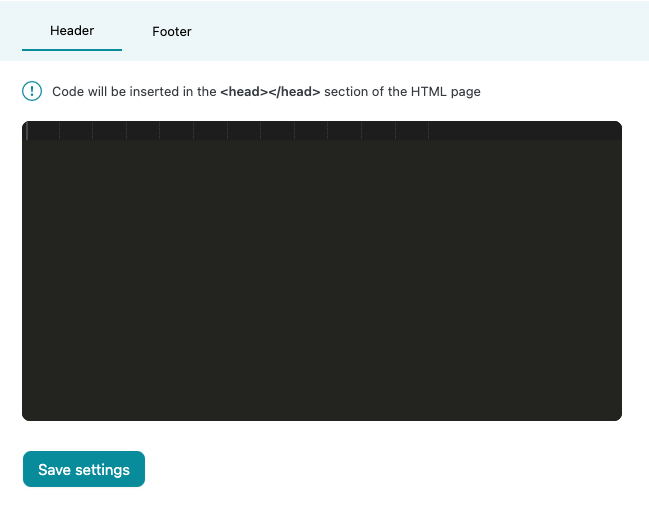
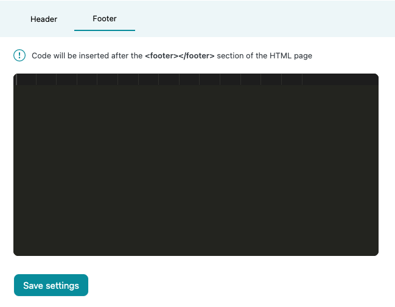

# Ads.txt insertion

Ads.txt is a public file that declares who is authorized to sell the publishers' inventory. The purpose of the ads.txt file is to ensure that publishers' ad inventory is only sold through authorized channels, and that they are paid the correct amount for their inventory. Ads.txt also helps to prevent fraud, such as domain spoofing.

Our plugin doesn't create a physical ads.txt file in your filesystem, it creates a virtual ads.txt file that is displayed for this URL: yourDomain.com/ads.txt.

## Before you insert ads.txt lines:

Our plugin won't insert ads.txt into your website if you already have ads.txt file in your file system/server. If you want to use ads.txt insertion, make sure you have deleted ads.txt from your file system/server.

If you have a subdirectory WordPress installation (e.g., yourDomain.com/subdirectory/WPInstallation), then you won't be allowed to save ads.txt lines. Make sure you have a root domain WordPress installation.

## Ads.txt line validation:

Our plugin validates your ads.txt lines., If there are any errors, the plugin will display on which ads.txt lines the errors were found. You still can update ads.txt with following errors by enabling **Update ads.txt anyway?** field.

---
title: Header and footer content insertion
layout: home
---

# Header and footer content insertion

**Header** - Insertion uses inbuilt WordPress **wp_head** hook and inserts your provided code inside the **&lt;head>** part of your website.

**Footer** - Insertion uses inbuilt WordPress **wp_footer** hook and inserts your provided code right after the **&lt;footer>** part of your website.

