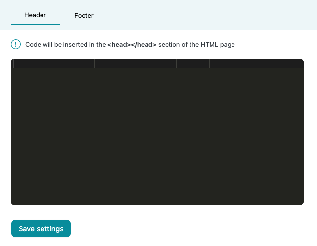

# Header and footer content insertion

**Header** - Insertion uses inbuilt WordPress **wp_head** hook and inserts your provided code inside the **&lt;head>** part of your website.

**Footer** - Insertion uses inbuilt WordPress **wp_footer** hook and inserts your provided code right after the **&lt;footer>** part of your website.

