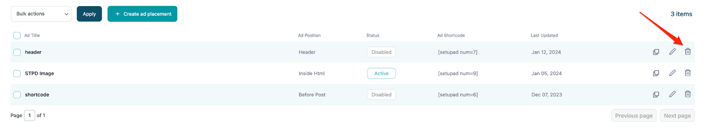
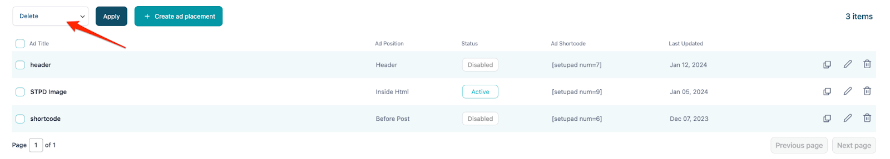

# Managing ad placements

Ad placement can be managed in the **My ads** section of the plugin.

**Creating ad placement** - ad placements can be created by clicking on the **Create ad placement** button.

**Duplicating ad placement** - ad placements can be duplicated in two ways:

1. Clicking the duplicate icon.

2. Select all ad units you want to duplicate. Click on **Bulk Actions** dropdown, choose **Duplicate** and click **Apply**.

**Editing ad placement** - ad placement can be edited in two ways:

1. Clicking the pencil icon in the **My ads** section.

2. Clicking the title of the ad placement.

**Disabling/enabling ad placements** - ad placement status can be toggled by pressing the button in the status column for your desired ad placement. Ad placement has **active** and **disabled** statuses.

**Sorting ad placements** - all ad placements can be sorted by simply clicking on the table column title. The ad placement will be sorted either in ascending or descending order.

**Delete ad placement** - ad placement can be deleted in 3 ways:

1. Clicking on the trash icon in the **My ads** section.

2. Clicking on the **Delete ad unit** button when editing existing ad placement.

3. Select all ad units you want to delete. Click on **Bulk Actions** dropdown, choose **Delete** and click **Apply**.

