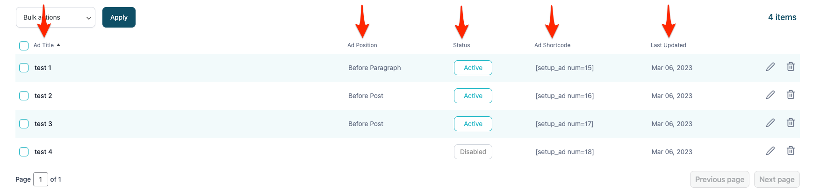
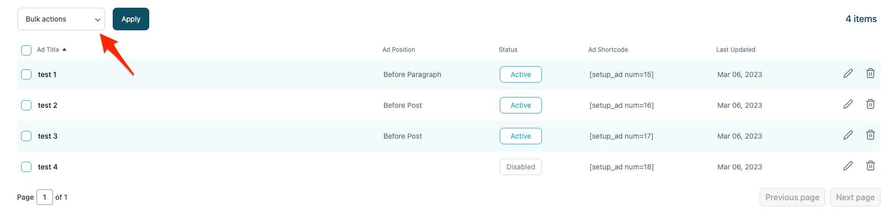

# Managing ad placements

Ad placement can be managed in the **My ads** section of the plugin.

**Editing ad placement** - ad placement can be edited to two ways:

1. Clicking the pencil icon in the **My ads** section.
   
2. Clicking the title of the ad placement.
   

**Sorting ad placements** - all ad placements can be sorted by simply clicking on the table column title. The ad placement will be sorted either in ascending or descending order.

**Delete ad placement** - ad placement can be deleted in 3 ways:

1. Clicking on the trash icon in the **My ads** section.
   
2. Clicking on the **Delete ad unit** button when editing existing ad placement.
   
3. Select all ad units you want to delete. Click on **Bulk Actions** dropdown, choose **Delete** and click **Apply**.
   
