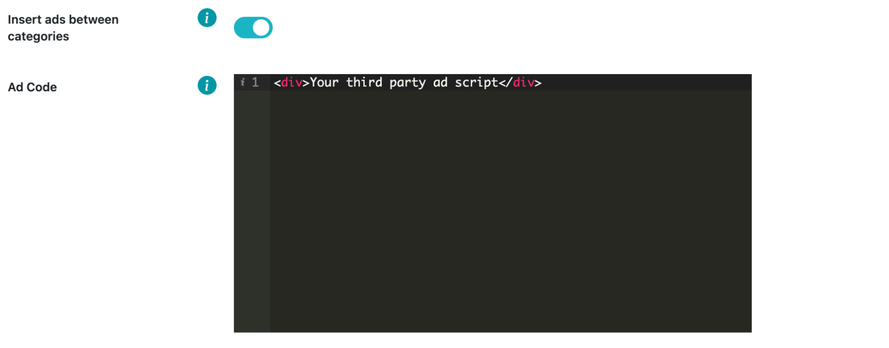

# Related posts

Related posts, or related articles block, automatically suggests top recommended articles to the user. Most of the time, it’s placed at the end of the article. It’s used to increase user engagement with the website and generate traffic to other articles within your site (more pageviews).

Related posts section uses inbuilt WordPress **the_content** hook to insert related posts after your post's main content.

## Related posts block:

This enables a related posts section on your website,you need to also fill other fields in this section, e.g., categories, posts per categories, etc.

## Related posts title:

In this field you can write your own related posts block title, if you leave it empty then your related posts block will have no title.

## Category selection:

In this selection, you must choose which categories you want to show in the related posts section. You can select an unlimited number of categories.

All categories shown in the dropdown menu are in your WordPress categories **(Posts > Categories)**.

## Show category titles:

This switch enables titles for each of your chosen categories. Category titles are automatically generated from your existing categories.

## Post count per category selection:

In this selection, you must choose how many posts you want to display per each category, e.g., 2, 4, 6, etc.

## Insert ads between categories:

This switch enables you to insert ads between every category section that you have selected previously. After this field is enabled, the **Ad code** input field will be shown and you will have to insert your third-party ad code there.

This is how the related posts section would look like if you selected 2 categories (cars, popular), 4 posts per category, and a 728x90 third-party ad script. 

