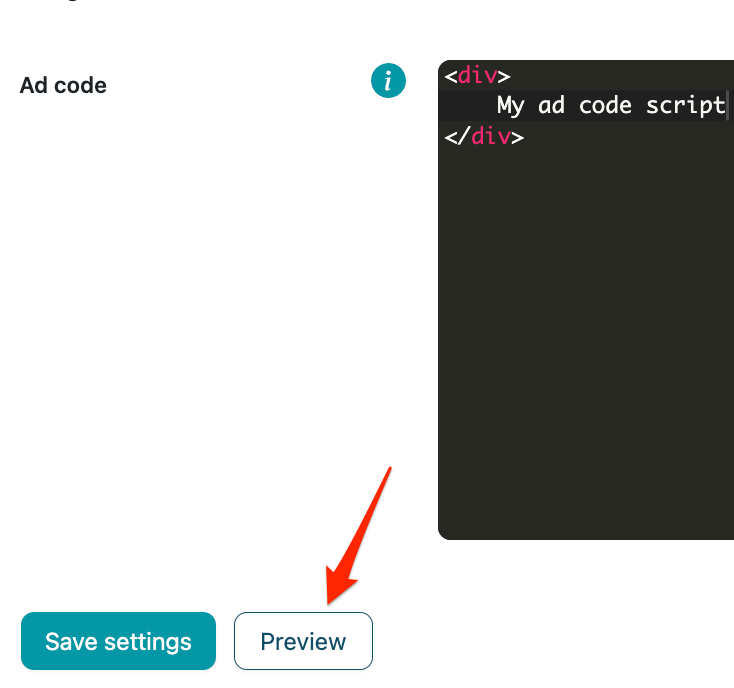

# Related posts

Related posts, or related articles block, automatically suggests top recommended articles to the user. Most of the time, it is placed at the end of the article. It’s used to increase user engagement with the website and generate traffic to other articles within your site (more pageviews).

Related posts section uses inbuilt WordPress **the_content** hook to insert related posts after your post's main content.

## Related posts block:

This enables a related posts section on your website,you need to also fill other fields in this section, e.g., categories, posts per categories, etc.

## Related posts title:

In this field you can write your own related posts block title, if you leave it empty then your related posts block will not have a title.

## Category selection:

In this selection, you must choose which categories you want to show in the related posts section. You can select an unlimited number of categories.

All categories shown in the dropdown menu are in your WordPress categories **(Posts > Categories)**.

## Show category titles:

This switch enables titles for each of your chosen categories. Category titles are automatically generated from your existing categories.

## Post count per category selection:

In this selection, you must choose how many posts you want to display per each category, e.g., 2, 4, 6, etc.

## Post title character limit:

In this field you can set a custom character limit for your post titles in the related posts block. The default value is 35. For example, if character limit is 35, the plugin will modify the post title to be cut to the last word that didn't exceed the 35 character limit and add “...” to the end of it.

## Post title alignment selection:

In this selection you can select one of the title alignment options to specify how your post titles will be aligned in the related posts block. The default selection is centered.

## Insert ads between categories:

This switch enables you to insert ads between every category section that you have selected previously. After this field is enabled, the **Ad code** input field will be shown and you will have to insert your third-party ad code there.

## Thumbnail dimensions:

These sliders allow you to modify the dimensions of the thumbnails that the related posts will have. The default dimensions are 350px width and 250px height.

## Related posts preview:

By clicking on the **Preview** button a pop up will appear displaying a preview of your related articles.

The preview displays how the related articles block will look with the parameters you have set in all the previous fields. To preview related articles it is not necessary to save the fields or enable the related articles block insertion. If you have enabled ad insertion, a placeholder ad block with dimensions 728x90 for desktop and 300x250 for mobile will also appear in the preview - this does not reflect your actual ad code being inserted and size/layout may differ depending on your ad placement and content layout.

This is how the related posts section would look like if you selected 2 categories (cars, popular), 4 posts per category, and a 728x90 third-party ad script. 

