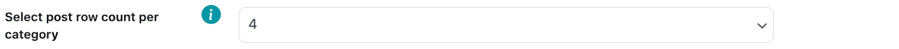
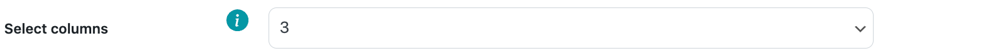
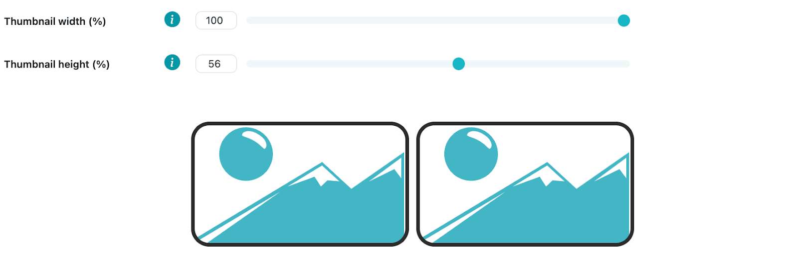
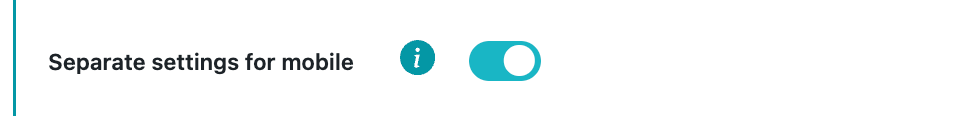
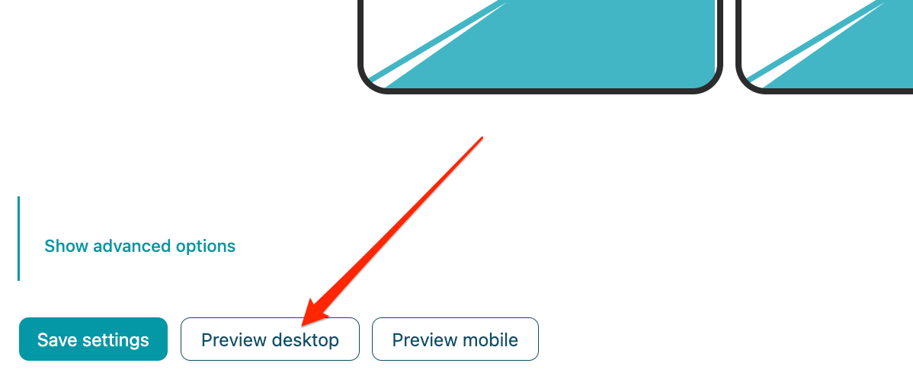
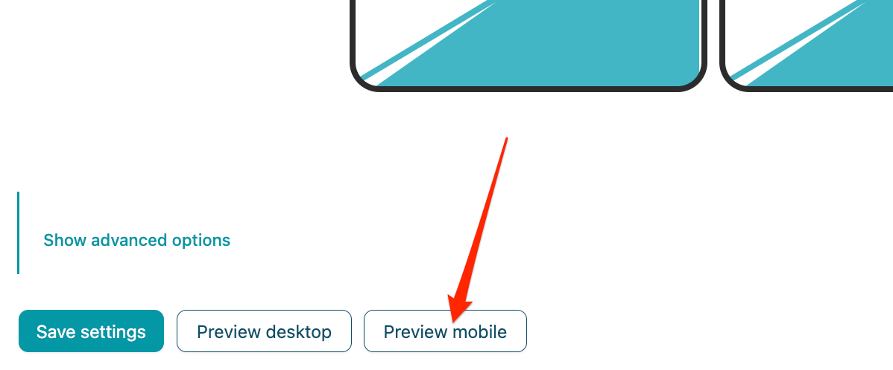

# Related posts

Related posts, or related articles block, automatically suggests top recommended articles to the user. Most of the time, it is placed at the end of the article. It’s used to increase user engagement with the website and generate traffic to other articles within your site (more pageviews).

Related posts section uses inbuilt WordPress **the_content** hook to insert related posts after your post's main content.

## Related posts block:

This enables a related posts section on your website,you need to also fill other fields in this section, e.g., categories, posts per categories, etc.

## Related posts title:

In this field you can write your own related posts block title, if you leave it empty then your related posts block will not have a title.

## Show category titles:

This switch enables titles for each of your chosen categories. Category titles are automatically generated from your existing categories.

## Category selection:

In this selection, you must choose which categories you want to show in the related posts section. You can select an unlimited number of categories.

All categories shown in the dropdown menu are in your WordPress categories **(Posts > Categories)**.

## Post row count per category selection:

In this selection, you must choose how many rows of posts you want to display per each category, e.g., 1, 2, 3, etc.

## Column selection:

In this selection you must choose how many columns of posts you want to display in your related posts. The options range from 1 to 4 columns.

## Post count per category selection:

In this selection, you must choose how many posts you want to display per each category, e.g., 2, 4, 6, etc.

## Post title character limit:

In this field you can set a custom character limit for your post titles in the related posts block. The default value is 35. For example, if character limit is 35, the plugin will modify the post title to be cut to the last word that didn't exceed the 35 character limit and add “...” to the end of it.

## Post title alignment selection:

In this selection you can select one of the title alignment options to specify how your post titles will be aligned in the related posts block. The default selection is centered.

## Insert ads between categories:

This switch enables you to insert ads between every category section that you have selected previously. After this field is enabled, the Ad placement dropdown field will be shown and you will have to select one of your previously created **ad placements** there. If you enable related posts ad placement it will not matter if this ad placement is disabled or if it is targeted to be displayed in post pages or only homepage, the placement will be displayed between related post categories regardless. Other options, for example, device targeting, alignment will still be available.

## Thumbnail dimensions:

These sliders allow you to modify the dimensions of the thumbnails that the related posts will have. The default dimensions are 100% width and 56% height (16:9 aspect ratio).

## Advanced options:

There are multiple advanced options that you can apply to the specified ad placement before insertion. To see these options, click “Show advanced options” and a dropdown menu of available options will appear.

## Separate mobile settings (1):

After enabling this checkbox option, a new navigation bar on the top of the page will appear allowing you to switch between Desktop and Mobile related posts settings.

When navigating to the Mobile section, you can customize the related posts for mobile users. All the options are the same as for desktop, however when browsing related posts  from mobile, these settings will now take place instead of default desktop settings.

## URL blacklist and whitelist (2):
There is an option to blacklist (exclude) and whitelist (include) URLs where you want or don't want related posts to be inserted.

It is also possible to use a wildcard where related posts will be excluded from any url that follows the format of the wildcard URL, e.g. /archives/* (It will exclude related post insertion for all archive URLs /archives/posts, /archives/posts/this-is-my-post, etc.).

To blacklist or whitelist URLs, you must add them to the respective URL list. 

To whitelist a URL, enter the URL in the “URL Whitelist” field and then press “Add”.

Only a single URL can be added at a time, if there is a wrong input, an error message will appear.

To remove a URL from your blacklist/whitelist click the delete icon next to the respective URL.

URL list is only saved when you save the ad unit, so make sure to save related posts settings after you are finished editing your whitelisted and blacklisted URLs.

## Related posts preview:

By clicking on the **Preview** desktop button a pop up will appear displaying a preview of your desktop related articles.

By clicking on the **Preview mobile** button a pop up will appear displaying a preview of your mobile related articles.

The preview displays how the related articles block will look with the parameters you have set in all the previous fields for desktop or mobile related posts. To preview related articles it is not necessary to save the fields or enable the related articles block insertion. If you have enabled ad insertion, a placeholder ad block with dimensions 728x90 for desktop and 300x250 for mobile will also appear in the preview - this does not reflect your actual ad code being inserted and size/layout may differ depending on your ad placement and content layout.

This is how the related posts section would look like if you selected 2 categories (cars, popular), 4 posts per category, and a 728x90 third-party ad script. 

