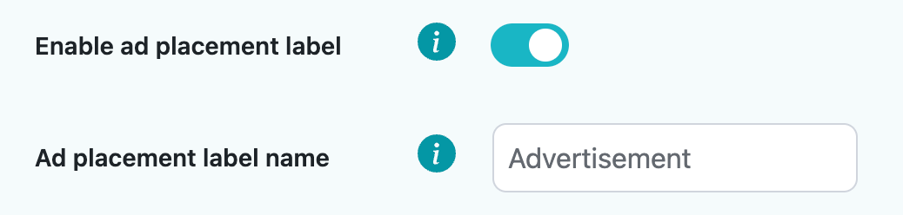

# Settings

Settings tab features various options for you to customize the plugin depending on your usage.

## Lazy load offset:

Setting is used to set your specified offset for lazy loaded ad placements for when the ad should load in depending on how many pixels it is away from the bottom of the users screen. Default value is **-400**, which means that the lazy loaded placements will load in when they are 400 pixels away from the bottom of the screen. A positive value would indicate the opposite, where the placement would load in when it crosses the positive threshold from the bottom of the screen, although this is **not** a suggested practice.

## Block class name:

Setting indicates what class will be used for 
 element to wrap the ad placement inside of it. Default is **stpd-wp-block**.

## Ad placement label:

Ad placement label has a checkmark that if enabled will display a label above all ad placements to indicate that it is an ad placement. Default label is **Advertisement**. You may customize the label in the **Ad placement label name** field.

## Exclude paragraphs inside:

Is a setting for **Before paragraph** and **After paragraph** ad placement positions, you can enter comma separated values of html elements from which to exclude paragraph insertion like commonly blockquotes that may be used in a WordPress page. There is no default value for this setting and paragraph insertion will be done in all paragraphs inside of your page contents.

